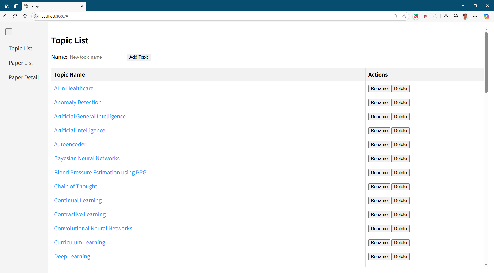
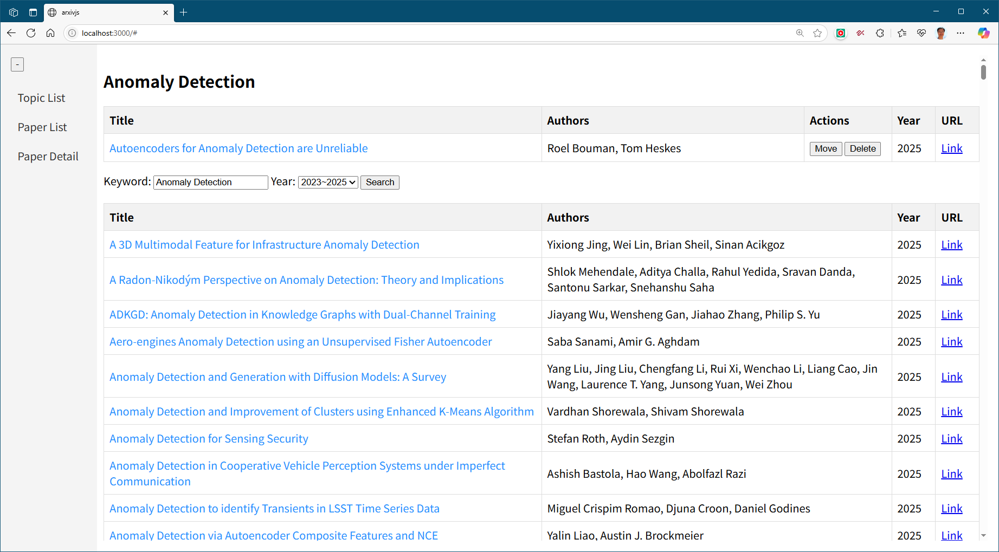
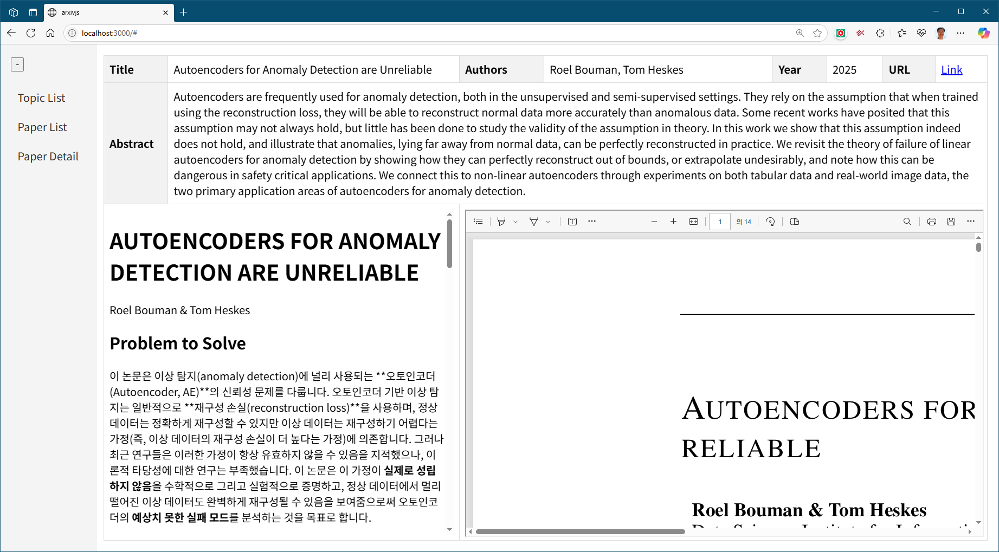

# arxivjs

arxivjs is a Node.js-based application, available as both a **web application** and a **desktop application**, that interacts with the arXiv API. It allows users to manage paper topics, search for papers related to those topics on arxiv.org, automatically summarize them using Gemini, and save the information for easy retrieval.

## Installation

### 1. Clone the repository

```bash
git clone https://github.com/your-username/arxivjs.git
cd arxivjs
```

### 2. Install dependencies

Make sure you have Node.js and npm installed. Then, run the following command in the project root directory:

```bash
npm install
```

### 3. Set up environment variables

Create a `.env` file in the root of the project and add your Gemini API key:

```ini
GEMINI_API_KEY=YOUR_API_KEY
```

You can use the Gemini API key by creating a project at <https://console.cloud.google.com/projectselector2/home/dashboard>, generating an API key at <https://aistudio.google.com/apikey>, and then activating the `Generative Language API` at <https://console.cloud.google.com/apis/dashboard>.

### 4. Write user prompt

Write a user prompt to `arxivjsdata/userprompt.txt` file.
Following shows an example.

```text
Please summarize the following paper.

The summary **must be written in Korean** and **must follow Markdown syntax** using a clear hierarchical structure with headings, bullet points, and formatting where appropriate.
Ensure the content is **concise, accurate, and easy to understand** for a technical but general audience.

Please follow these formatting rules:

- At the very top, display:
  - The **paper title** on the first line as a "#" heading.
  - The **author list** on the second line as plain text (comma-separated), below the title.

- Then use the following summary structure:
  - ## 🧩 Problem to Solve
    - Clearly describe the main research problem or question the paper aims to address.
  - ## ✨ Key Contributions
    - List the core findings and novel contributions as bullet points.
  - ## 📎 Related Works
    - Mention key prior works referenced in the paper.
  - ## 🛠️ Methodology
    - Describe the approach or algorithm used, preferably with steps or bullet points.
  - ## 📊 Results
    - Summarize quantitative or qualitative results briefly.
  - ## 🧠 Insights & Discussion
    - Explain the implications, any limitations, or significance of the results.
  - ## 📌 TL;DR
    - Provide a TL;DR summary of this paper, highlighting the main problem, proposed method, and key findings.

- Guidelines for writing in Markdown format:
  1. Use braces around multi-character subscripts or superscripts in MathJax to avoid rendering errors.
  2. Use $...$ for inline math and $$...$$ for block math to ensure compatibility with MathJax.
  3. Do not use backticks (`) for math; use dollar signs ($) to allow proper MathJax rendering.

Here is the paper content:

{context}
```

## Usage

You can run arxivjs as a web application or a desktop application.

### Web Application

To start the web server, run the `run_arxivjs_server.bat` script or execute the following command from the project root directory:

```bash
npm run dev
```

Once the server is running, open your web browser and navigate to `http://localhost:8765` (or the port specified in your configuration).

### Desktop Application

To start the desktop application, run the `run_arxivjs_app.bat` script or directly execute the application at `dist/arxivjs-win32-x64/arxivjs.exe`.

## Screenshot






